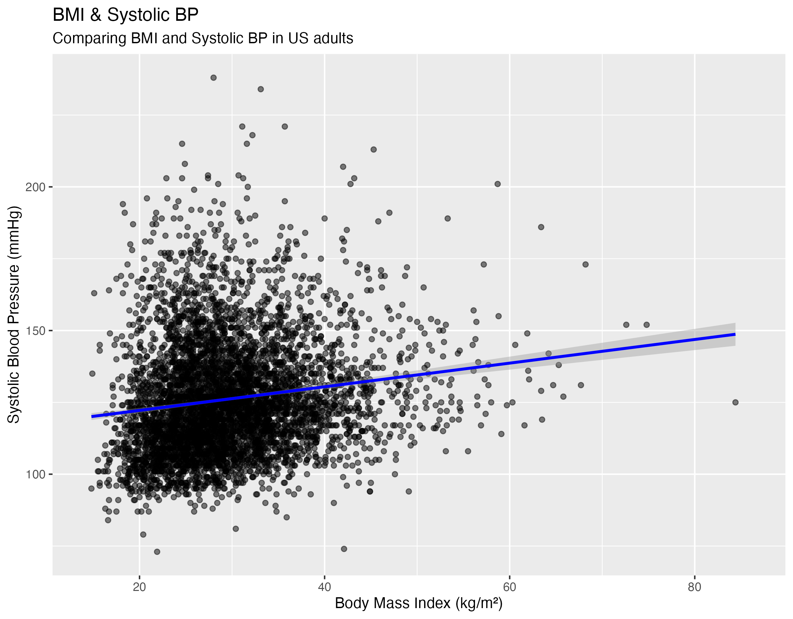
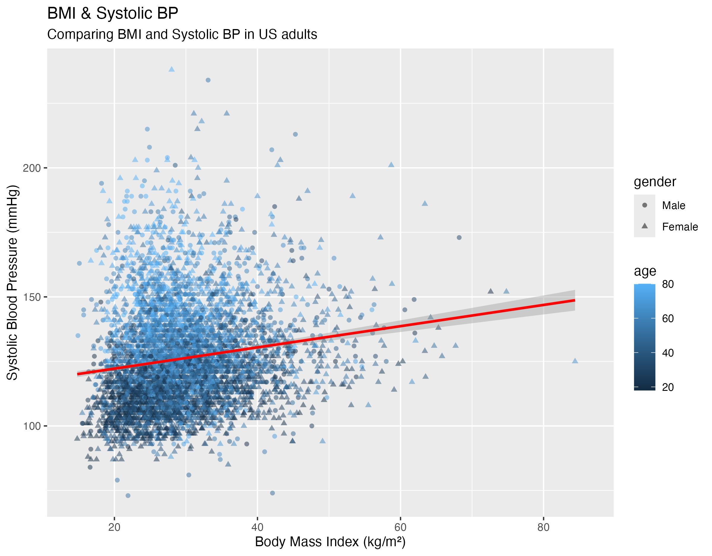

# BMI and Systolic Blood Pressure in US Adults (NHANES 2017–2018)

A self-directed data-analysis project examining whether higher BMI is associated with higher systolic blood pressure, and if association holds accounting for age and sex.

## Question

In US adults, is higher BMI associated with higher systolic blood pressure, and persisting after adjusting for age and sex?

## Data & Methods

I used the 2017–2018 NHANES cycle (the "J" cycle), publicly available CDC survey data. I merged three tables: demographics, body measures, and blood pressure on the respondent identifier (SEQN), then averaged up to four systolic readings per person into a single value. After restricting to adults (age ≥ 18) and dropping rows missing key variables, the analytic sample was n ≈ 5,179. Analysis was done in R using the tidyverse. I fit two ordinary least-squares regressions: a simple model (`systolic ~ BMI`) and an adjusted model (`systolic ~ BMI + age + sex`).

## Results

In the simple model, each one-unit increase in BMI was associated with a 0.41 mmHg increase in systolic blood pressure (p < 0.001), but BMI on its own explained very little of the variation (R² = 0.02).

Coloring the same points by age makes the confounding visible: higher-BMI individuals also tend to be older. In the adjusted model, the BMI slope changed only modestly, to 0.38 mmHg per BMI unit (p < 0.001), while age emerged as the strongest predictor at 0.52 mmHg per year (p < 0.001); holding BMI and age constant, women averaged 1.95 mmHg lower than men (p < 0.001). Adding age and sex raised R² from 0.02 to 0.26, with nearly all of that gain attributable to age.

## Interpretation

BMI is statistically but weakly associated with systolic blood pressure, and the association is largely unchanged after adjustment, suggesting it reflects more than a simple stand-in for age or sex. Even so, BMI explains little variation by itself; age is by far the dominant predictor in this sample.

## Limitations

The data are cross-sectional, so these results describe association, not causation. I also did not apply NHANES survey weights, so the estimates are not formally representative of the US adult population; a weighted analysis would be the appropriate next step for population-level inference.
